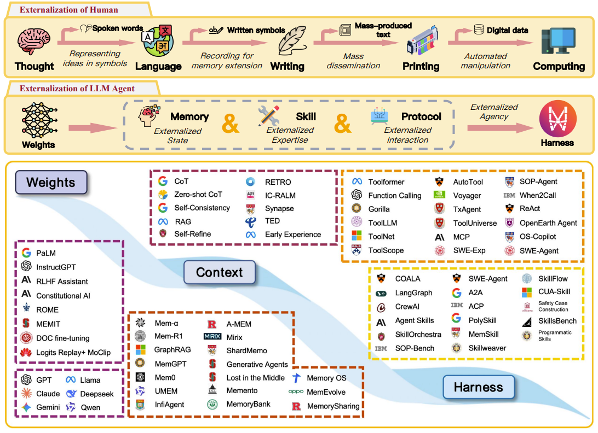
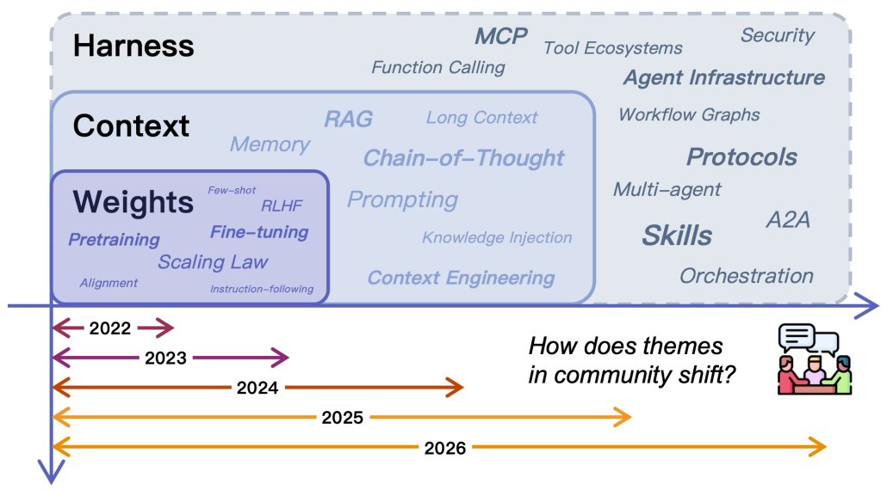

# Externalization in LLM Agents

> **文档信息**
> - **解读对象**：`arXiv:2604.08224`《Externalization in LLM Agents: A Unified Review of Memory, Skills, Protocols and Harness Engineering》
> - **发布信息**：2026年4月9日，由上海交通大学、中山大学、上海创智学院、卡内基梅隆大学及OPPO等机构的20多位作者联合发布，共54页。
> - **撰写目标**：严格按照综述结构，提取技术细节，保持深度和广度，同时确保清晰易读。
> - **图表索引**：原论文共包含 7 张核心图表（Figure 1–7），本笔记在各对应章节标注了引用位置。

## 1. 引言：从“模型主义”到“系统主义”的范式转移

长久以来，AI领域遵循的是一种“模型主义”信仰：模型越强，能力越强。但在Agent的实际部署中，工程师们发现一个普遍现象：**换一个更强的基座模型，效果往往不如改进外部基础设施来得显著**。持久化记忆、可复用的技能文档、标准化的工具接口……这些“不属于模型”的东西，越来越决定着Agent的成败。

论文将这一现象归因于大语言模型固有的**三个结构性错配**：

1.  **连续性错配**：上下文窗口是有限的，模型无法跨会话稳定保持状态，每次对话都是一次“全新开始”。
2.  **一致性错配**：复杂任务需要多步推理，但模型对同一任务在不同时间、不同上下文下的执行结果难以保证一致。
3.  **协调性错配**：模型与工具、服务和其他Agent的交互依赖临时的自然语言约定，API一变，整个链路可能立即失效。

论文的核心贡献，是借用认知科学家唐纳德·诺曼（Don Norman）的**认知人工物（Cognitive Artifacts）** 理论，提出了“**外部化（Externalization）**”这一统一分析框架。

### 1.1 核心理论框架：外部化

诺曼的理论指出，一张购物清单的作用，不是扩展了你的记忆容量，而是**把一个困难的“回忆”问题，变成了一个简单的“识别”问题**。外部工具通过**表征变换（Representational Transformation）**，改变了任务本身的性质。

论文将这一理论平移至AI领域，提出了“外部化”作为理解Agent架构演进的统一逻辑。**外部化的本质，就是把那些模型不擅长解决的高难度认知负担，通过设计精妙的外部基础设施，转化为模型更容易处理的形式。**



**上图解读（原论文 Figure 1）**：这是一张三面板组合图，构成了整篇论文的核心论点可视化表达：

- **上方面板 — 人类认知外部化弧**：展示了从思维（Thought）→ 语言（Language）→ 文字（Writing）→ 印刷（Printing）→ 计算（Computing）的演进路径。每个阶段都是一种“认知人工制品”，将原本需要大脑内部完成的困难任务转化为更简单的形式。例如文字将“回忆”转化为“识别”，计算将“手动推导”转化为“自动执行”。

- **中间面板 — LLM Agent 外部化弧**：对应人类弧线，展示 LLM Agent 的能力载体演进——权重（Weights）→ 记忆/技能/协议（Memory/Skills/Protocols）→ Harness。这正是论文的核心主张：Agent 的演进趋势是从依赖模型内部参数，逐步走向构建外部基础设施。

- **下方面板 — 文献景图（Literature Landscape）**：将 Agent 领域代表性文献映射到三层能力层（Weights / Context / Harness），展示社区研究重心的实际迁移。与 Figure 2（演进时间线）形成互补视角——Figure 1 给出静态的快照分类，Figure 2 展示随时间的变化趋势。

三条弧线的平行关系编码了一个递归主张：**LLM Agent本身就是运行在人类最新外部化产物（数字计算）之上的人工制品。**



**上图解读（原论文 Figure 2）**：这张图将 2022–2026 年 Agent 领域的研究重心迁移可视化呈现为三层堆叠结构：

- **底部 — Weights 层（2022–2023）**：能力主要来自模型参数。代表性工作包括 GPT-3、LLaMA 等基础模型及 RLHF 对齐技术。此阶段的研究焦点是“训练更好的模型”。

- **中部 — Context 层（2023–2024）**：模型保持冻结，能力通过精心设计的上下文输入来实现。Prompt Engineering、Chain-of-Thought、RAG、ReAct 等技术的兴起标志着研究焦点转向“给模型更好的提示”。

- **顶部 — Harness 层（2024–至今）**：能力来源于围绕模型构建的持久化基础设施。Auto-GPT、LangGraph、Agent 框架、记忆系统、技能注册表、MCP 协议等构成了这一层的研究主体。焦点是“给模型更好的运行环境”。

三层并非相互替代而是叠加共存——Weights 的重要性在任何阶段都不会消失，改变的是开发者投入边际精力的位置。**与 Figure 1 下方面板的文献景图互为补充：Figure 1 是静态分类快照，Figure 2 是随时间变化的动态视图。**

### 1.2 “外部化”的三种能力载体

基于这一理论，论文将LLM Agent演进分为三个历史阶段，清晰地展示了外部化趋势。

| 阶段 | 时间窗口 | 核心载体 | 基本原理 | 典型技术 |
| :--- | :--- | :--- | :--- | :--- |
| **权重层** | 2022-2023 | `Weights` | 能力几乎完全等同于模型参数。知识、推理习惯、程序性步骤都被压缩进静态的权重里。 | 基础LLM（GPT-3, LLaMA）、RLHF |
| **上下文层** | 2023-2024 | `Context` | 保持模型冻结，不修改参数，而是在Prompt中注入指令和示例。将“回忆/生成”问题转化为“遵循/识别”问题。 | Prompt Engineering、CoT、RAG、ReAct |
| **Harness层** | 2024-至今 | `Harness` | 把模型视为一个计算引擎，围绕它构建一套完整的软件基础设施层，用于管理状态、技能、交互和执行策略。 | Auto-GPT、LangGraph、各种Agent框架 |

### 1.3 外部化的四个支柱

论文进一步将外部化的具体形态，归为**四个相互耦合的技术支柱**：

*   **记忆（Memory）**：外化**跨时间的状态**。将那些需要长期或短期保存的信息，从模型有限的瞬时记忆中搬出来，存入外部的记忆系统。
*   **技能（Skills）**：外化**程序性专业知识**。将经过验证的、可重复执行的任务流程（即“程序性知识”），包装成标准化的可调用模块，避免每次都需要模型重新生成。
*   **协议（Protocols）**：外化**交互结构**。为Agent与外部世界（工具、API、其他Agent）的通信，提供标准化的契约，确保交互的确定性和可预测性。
*   **Harness**：外化的**统一协调层**。它不直接提供能力，而是像“操作系统”一样，负责将记忆、技能、协议以及其他基础设施组件，编织成一个可靠的执行环境。

> **原论文 Figure 3（外部化Agent架构总览）**：展示了外部化Agent的完整架构。Harness位于中心，协调三个外部化维度——Memory（跨时间状态外部化）、Skills（程序性专业知识外部化）、Protocols（交互结构外部化）。外围环绕着沙箱（Sandbox）、可观测性（Observability）、评估器（Evaluator）、审批循环（Approval Loop）等操作元素，共同构成完整的“感知-决策-执行”闭环。

接下来，我们将逐一深入这四个支柱的技术细节。


## 2. 记忆机制：状态在时间维度上的外化

### 2.1 为什么需要外化记忆？

大语言模型（LLM）本质上是一个**无状态（Stateless）** 系统。它的上下文窗口（Context Window）就像一个极小的、临时的、易失的RAM。这导致了两个核心问题：

1.  **“大海捞针”效应（Lost in the Middle）** ：随着窗口内容增加，模型对中间位置信息的注意力会显著下降，长文本中的关键信息可能被忽略。
2.  **成本与延迟**：每次都将所有历史记录打包输入，Token消耗和推理时间会呈线性增长，很快超出经济与性能边界。

因此，为LLM Agent构建独立的外部记忆系统，就如同为CPU配备大容量的硬盘和数据库，是走向自主智能的必经之路。

### 2.2 记忆架构的五种模式

产业界经过实践，已经收敛出五种主流的Agent记忆架构模式，它们的组织方式与技术权衡各不相同：

> **原论文 Figure 4（记忆外部化状态架构）**：展示了原始上下文（来自临时上下文窗口和环境反馈）如何转化为四个持久的记忆维度——工作上下文（Working Context）、情节经验（Episodic Experience）、语义知识（Semantic Knowledge）和个性化记忆（Personalized Memory）。这些维度通过四种渐进式架构组织：单体上下文 → 带检索存储的上下文 → 分层记忆与编排 → 自适应记忆系统（结合动态模块、RL/MoE路由等）。在Harness侧，技能和协议的执行轨迹流入外部化记忆系统，后者再通过直接召回和策展快照向Agent核心提供任务相关内容。

*   **模式一：全上下文工作记忆 (In-Process / Working-Only)**
    不依赖外部存储，所有记忆都直接在上下文窗口中处理。这是最简单直接的零基础设施方案，可以达到最高的准确率（72.9%），但代价是P95延迟极高（17.12秒）。它只适合任务粒度小、交互轮次少的场景。

*   **模式二：扁平外部向量存储 (Flat External Vector Store)**
    这是最普遍的外部记忆架构。将Agent的对话历史和知识，通过Embedding模型转化为高维向量，存入单一的向量数据库（如FAISS、Milvus）。查询时，通过**余弦相似度**计算，检索出语义上最相似的Top-K个信息片段。这种模式在准确率和延迟之间取得了比较好的平衡，准确率为66.9%，P95延迟仅为1.44秒。它的核心局限在于缺乏对复杂逻辑关系（如因果关系、层级结构）的建模能力。

*   **模式三：分层记忆 (Tiered Memory)**
    引入了**“热/温/冷”** 的分层思想，由Agent自身（如通过MemGPT/Letta框架）来自主管理不同数据的存储层级。例如，最近几轮对话放在“热”层（如Redis缓存）以实现毫秒级快速存取；重要的历史信息摘要放在“温”层；长期沉淀的知识库则放在“冷”层（如对象存储）。这种方式能在保证效率的同时，管理超大规模的长期记忆。

*   **模式四：知识图谱 + 向量混合架构**
    为了解决纯向量检索缺乏逻辑关联能力的短板，混合架构应运而生。**知识图谱（KG）** 以实体和关系组成的网络结构，精确建模了数据间的复杂关联。当Agent需要回答“A公司的CEO和B公司的产品之间有什么间接联系？”这类多跳问题时，它可以在KG中执行图遍历算法（如BFS），而非依赖语义相似度的模糊匹配。Benchmark数据显示，混合架构可以将准确率从72%提升至85%。

*   **模式五：企业级上下文层 (Enterprise Context Layer)**
    这是Atlan等企业采用的最成熟方案，它将记忆视为一种受治理的元数据图。它不仅存储了内容，还详细记录了数据的来源、权限、生命周期等元信息，满足企业级的数据合规与安全管控要求。

### 2.3 混合记忆架构的深度实现

现代Agent记忆系统的最新趋势是向**混合存储架构**演进。一个典型的方案由三个层面协同构成，并配上智能路由：

*   **三层存储协同**:
    *   **向量存储层（Semantic Matching）**：负责处理语义相似性匹配，负责模糊查询。
    *   **图存储层（Relational Reasoning）**：负责建模实体之间的关系网络，用于精确的逻辑推理。
    *   **键值存储层（State Persistence）**：用于维护结构化的状态变量，提供O(1)时间复杂度的快速访问。

*   **智能路由**
    这套系统需要一个“大脑”来决定将用户的输入发送到哪个存储层。**Graphiti引擎**提出了一个技术细节：通过一个轻量级的神经网络来实现智能路由。该模型接收用户查询的嵌入向量，经过一个包含768维输入、256维隐藏层的小型网络（通常是一个2-3层的MLP，激活函数为ReLU），最终输出一个权重向量，指示该查询与三个存储层的匹配程度，从而实现最优的存储选择。

*   **图-向量联合编码**
    为了解决向量和图的异构性，混合系统采用**双塔编码器（Two-Tower Encoder）** 。它将文本和相关的图结构分别通过两个编码器映射到一个联合的向量空间中。通过对比学习，训练模型使得图谱中相邻的节点和其描述的文本向量在联合空间中的相似度最大化（业界目标可达0.85以上），从而实现了跨模态的对齐，确保Agent在进行语义检索时，也能感知到相关的图结构信息。


## 3. 技能工程：程序性专业知识的外化

### 3.1 为什么需要技能？

传统Agent的能力扩展，严重依赖基础模型（Base Model）的泛化能力和Tool Use的配合。这种模式面临两大局限：

1.  **上下文溢出**：为描述一个复杂任务（如“撰写一份符合某公司财报规范的财务报告”），需要在Prompt中嵌入大量步骤和规则，这极易超出上下文限制。
2.  **能力无法复用**：不同项目中的同类业务流程无法被标准化和复用，导致开发者反复“造轮子”。

### 3.2 技能架构：从耦合到解耦

Agent技能的核心理念是**能力解耦**和**知识沉淀**。它将定义好的流程和领域知识封装成一个独立的、可被发现和调用的软件模块。

> **原论文 Figure 5（技能完整生命周期）**：展示了从 Invocation（调用触发）→ Selection（技能选择）→ Procedure（过程执行）的完整技能生命周期。技能系统将程序性专业知识外化为可发现、可加载、可修订、可组合的显式制品，将模型从"每次发明工作流"转变为"选择和遵循工作流"。

Agent技能的模块化演进经历了几个关键阶段。**提示词工程阶段**（2022-2023）将知识写在Prompt里，但受限于上下文长度，且响应延迟增加30%以上。**函数调用阶段**（2023-2024）通过`function_call`调用API，但工具注册表膨胀，维护成本高昂。**Agent框架阶段**（2024）引入ReAct等模式，但技能与特定框架深度绑定（90%的代码耦合），迁移成本极高。**技能标准化阶段**（2025至今）通过元数据驱动和标准化封装，实现了能力与执行逻辑的彻底解耦。

一个标准化的技能，其物理结构通常如下：
```text
/skills
  └── pdf_parser/         # 技能根目录
        ├── SKILL.md      # 元数据定义：名称、版本、依赖、输入输出schema
        ├── handler.py    # 核心执行逻辑（Python代码）
        ├── config.json   # 技能专属参数配置
        └── templates/    # 可选：模板资源文件
```

其中，`SKILL.md`（或JSON格式）用标准Schema精确描述了技能的“接口”（Input/Output Schema），供Agent在运行时进行解析和校验，确保了调用的可靠性。

### 3.3 技能的动态加载

为了降低资源占用，技能系统普遍采用**“懒加载”（Lazy Loading）** 策略：

1.  **静态发现阶段**：Agent启动时，仅通过查询技能注册中心（Skill Registry）获取技能的**元数据**，如ID、功能描述和输入输出Schema，不会加载具体的执行代码。
2.  **动态加载阶段**：当Agent经过推理，确定需要调用某个技能时，系统才会根据元数据中的路径，在**沙箱（Sandbox）** 环境中加载并执行对应的`handler.py`。内存占用降低40%，冷启动速度提升65%。

*   **与MCP的关系**
    技能与MCP（Model Context Protocol）是互补而非替代关系。MCP定义的是**“做什么”** ，即Agent能通过标准化协议发现和调用哪些外部工具，解决能力边界问题；而Agent Skills定义的是**“怎么做”** ，即如何将一系列基础工具调用、业务规则和领域知识，组合编排成一个可复用的**方法论**。


## 4. 协议工程：交互结构的外化

### 4.1 交互困境：为什么需要标准协议？

在没有标准协议之前，Agent与工具、API或其它Agent的交互是脆弱且混乱的。论文将其总结为“三重乱象”，这正是技术债务的主要来源：

1.  **接口碎片化**：不同工具的API设计逻辑、参数格式、认证方式千差万别，没有统一标准。这导致每个项目都需要为每个工具编写定制的适配器层，平均增加40%的代码量，是73%项目面临的挑战。
2.  **私有脚本的脆弱性**：为快速实现功能，开发者常使用临时脚本，其中往往存在**硬编码的API密钥**和**版本锁定**等隐患。据统计，35%的此类脚本未纳入版本控制，极易因目标API升级而失效。
3.  **协同困境**：不同模型、不同厂商的Agent之间缺乏标准化的交互语言，使得构建复杂、分布式的多Agent系统变得极其困难。

> **原论文 Figure 6（协议外部化的四个维度）**：展示了协议外化的完整设计空间——调用语法（Call Syntax）、生命周期语义（Lifecycle Semantics）、安全边界与权限（Security Boundaries & Permissions）、错误恢复策略（Error Recovery）。协议的实质是将交互负担从自由形式的交际推理（free-form communicative inference）转变为结构化交换（structured exchange），模型不再需要即兴发明消息格式和参数结构。

协议的设计空间可沿**四个维度**展开，这也是协议工程要外化、结构化的核心内容：

1.  **调用语法**：协议通过预定义的模式（Schema）和类型化接口，明确了每个参数的名称、类型、顺序和返回结构，使模型从“猜测语法”变为“填充字段”。
2.  **生命周期语义**：在复杂任务中，协议通过显式的状态机（State Machine）或事件流，定义了每一步的操作权限、状态转换和执行者，确保了任务流程的可预测性。
3.  **安全边界与权限**：协议规定了Agent能做什么、不能做什么，并对敏感操作强制要求审批和审计，确保系统在安全边界内运行。
4.  **错误恢复策略**：协议会定义标准化的错误类型和格式（如机器可读的错误码），使Agent能识别错误并自动采取补偿措施，而非简单崩溃。

### 4.2 MCP：Agent工具调用的“通用语言”

在众多协议方案中，论文重点分析了由Anthropic发起、已贡献给Linux基金会Agentic AI基金会的**MCP（Model Context Protocol）**。它已成为事实上的主流标准之一。

MCP采用**客户端-服务器（Client-Server）** 架构，但它不是将所有工具API直接暴露给LLM，而是通过一个“MCP Server”作为代理层。这个Server遵循MCP规范，将工具的元数据和调用接口进行标准化封装。Agent（MCP Client）通过`tools/list`端点发现工具，通过`tools/call`端点按标准化JSON-RPC 2.0格式调用工具，实现了客户端与工具间的彻底解耦。

### 4.3 协议在生产环境中的挑战与演进

MCP虽然标准化了“如何调用”，但论文通过一个企业级部署案例，指出了其在实际生产中的挑战，并提出了演进方向。

在生产环境中，Agent的可靠运行不能只依赖协议调用，还需要基础设施层面的能力，以应对**生产环节的八大失败模式**，包括但不限于：**身份与权限**（如何确保Agent按用户身份调用）、**工具预算**（如何防止工具无限循环或超出时间预算）、**错误与恢复**（如何从调用失败中恢复）、**可观测性**（如何追踪和调试工具调用链）。

为应对这些挑战，论文提出了几个关键技术方案：

1.  **CABP（Context-Aware Broker Protocol）** ：一个扩展了JSON-RPC的代理协议。它在原始的MCP调用链中插入了一个包含**身份验证→授权→速率限制→路由→转换→审计**六个阶段的Broker Pipeline，用于处理身份、权限、治理等横切关注点。
2.  **ATBA（Adaptive Timeout Budget Allocation）** ：一种针对工具调用的智能超时预算分配算法。它将Agent执行的一系列工具调用视作一个总时间预算分配问题。系统会根据每个工具的历史延迟分布，动态地为单个工具调用设置超时时间，既防止单一工具卡死，也避免因总预算耗尽而导致任务失败。
3.  **SERF（Structured Error Recovery Framework）** ：一个标准化的错误恢复框架。它规定了**机器可读的失败语义**（带错误码和结构化信息的JSON错误信息），使Agent能够确定性地识别错误类型，并自动触发预设的补偿或重试策略，从而实现**确定的自我修正**。


## 5. Harness工程：统一的外化协调层

如果说记忆、技能、协议分别解决了特定类型的能力外化，那么**Harness就是将所有外化组件集成到一个统一框架中的关键系统层**。

> **原论文 Figure 7（Harness作为认知环境）**：展示了Harness的完整架构布局。基础模型（Agent Core）位于中心，六个Harness维度构成协同环：三个外部化模块——Memory（状态持久化、失败记录、跨会话上下文）、Skills（可复用例程、分阶段加载、迭代修订）、Protocols（确定性调用、结构化契约）；以及三个运维面——Permission（沙箱隔离、系统隔离、网络限制）、Control（递归边界、成本悬崖、超时）、Observability（日志、指标、追踪等）。箭头表示Harness循环中各维度之间的持续流动。

此外，**原论文 Figure 3**（第1.3节已引用）从更高的层面展示了同一个Harness架构——中心是协调层，外围环绕着沙箱、可观测性、评估器、审批循环等操作元素。

### 5.1 Harness的12个核心组件

一个生产级的Agent Harness，其架构复杂性远超一个简单的“模型调用循环”。它通常由**12个核心组件**构成，形成一个完整的“感知-决策-执行”闭环。

*   **执行与编排层**:
    *   **编排循环引擎 (Orchestration Loop Engine)**：Agent的心脏。它通常实现为基于状态机的无限循环，能够处理分支、循环、错误重试和中断等复杂逻辑。
    *   **工具调用框架 (Tool Calling Framework)**：采用“三明治”模式（请求预处理 → 工具调用 → 结果验证），负责参数验证、超时处理、结果解析等，确保工具调用的健壮性。
    *   **状态持久化方案 (State Persistence)**：用于将Agent的执行状态（如当前任务、进度、已完成步骤）持久化到数据库，确保即使在服务器重启后，也能无缝恢复任务。

*   **记忆与上下文管理层**:
    *   **记忆系统 (Memory System)**：综合运用第2节中介绍的混合记忆架构，提供短期和长期记忆能力，是任务连续性、一致性的关键。
    *   **上下文优化器 (Context Optimizer)**：通过滑动窗口、摘要生成、关键信息识别等技术，动态管理上下文，将平均窗口大小从8K Token压缩至3.2K Token，减少32%的Token消耗。

*   **治理与可靠性层**:
    *   **验证回路 (Verification Loop)**：构建多级验证体系，包括基础的语法检查、通过调用另一个“验证”模型来检测逻辑矛盾的逻辑验证、以及通过比对知识图谱进行陈述核验的事实核查。三级验证体系可将错误输出率降低约85%。
    *   **安全护栏 (Safety Guardrails)**：一个独立的安全层，负责对用户输入和Agent输出进行内容审查，防止生成不安全内容。
    *   **可观测性套件 (Observability Suite)**：提供日志、指标、追踪等全面的可观测性，是实现Harness“可治理”原则的基础保障。

*   **基础设施与资源层**:
    *   **技能发现与管理 (Skill Discovery & Management)**：Agent技能仓库的管理者，负责技能的元数据查询、版本控制和热加载。
    *   **协议适配层 (Protocol Adapter Layer)**：使Agent能够通过标准化协议（如MCP）与外部世界通信。
    *   **资源调度与隔离 (Resource Scheduling & Isolation)**：在生产环境中，利用Kubernetes HPA根据QPS自动调整Pod数量，实现弹性扩缩容。

这种架构带来的性能提升是显著的。一份对比实验数据显示，优化后的Harness使Agent的任务完成率从41%跃升至89%。

### 5.2 Harness的理论化与工程设计模式

随着Harness工程的发展，研究者们开始追求其设计的理论化，以确保系统的可验证性和可组合性。

*   **范畴论视角的形式化**
    Bogdan Banu的论文《Harness Engineering as Categorical Architecture》提供了一个富有启发性的理论框架。该论文运用**范畴论（Category Theory）**，将一个Agent系统形式化地建模为一个被称为**Architecture Triple的三元组（G, Know, Phi）**。
    *   `G`：**句法连接**，对应**协议（Protocols）**，定义了组件间如何“连接”。
    *   `Know`：**知识表达**，通过“**Integrity Gates（完整性门限）**”等形式化为质量证书，对应**Harness中的治理与验证**。
    *   `Phi`：**整体架构**，对应**Harness本身**，是包含所有组件的大型结构。

    该理论的重要价值在于，它使得Harness的某些属性（如安全证书）可以通过编译器（一个将高级Harness配置转换为具体框架代码的编译器）进行**结构性的验证和保留**。该论文通过一个验证实验证明了这一点：其设计的编译器能将Harness配置成功编译到包括LangGraph在内的多个主流框架上，并且在编译后，关键的结构性证书（如完整性门限）得以保留。

*   **工程模式**
    在工程层面，Harness工程已形成**“从Context到Harness的云端工程革命”** 的共识。其关键设计模式包括：

    *   **执行权限隔离**：为实现安全可靠的执行，现代Harness架构通过**安全容器**（如Kata Containers或gVisor）为每个Agent提供隔离的执行环境，将Agent与宿主系统隔离。同时，在架构上推行“**代理人即工具（Agents as Tools）** ”模式，通过将复杂任务分解为多个“内部Agent”，由“外部Agent”像调用普通工具一样进行调度，实现责任的解耦和隔离。

    *   **状态持久化与动作标准化**：Agent的关键执行状态需持久化到外部队列或数据库中。为解决多模型、多框架间的执行问题，Harness往往定义一套**统一的Action Schema**来描述Agent可执行的操作（如文件读写、API调用），这些Schema通常包含操作类型、参数对象、超时时间等标准字段，从而实现Agent动作的标准化和可追踪性。


## 6. 权衡、挑战与展望

### 6.1 参数化能力 vs. 外化能力：系统级权衡

论文并没有一味推崇外化，而是严肃地指出了这是一个**系统级的权衡**问题。过度外化可能会损害模型的泛化能力和鲁棒性，因为模型变成了“套在Harness里才会解决问题的模型”。

对于开发者而言，以下几个决策点尤为重要：

1.  **延迟**：外化的每一步都伴随着网络I/O和序列化开销。一个工具调用需要RPC开销，多层技能嵌套、多级记忆检索都会显著增加延迟。
2.  **系统复杂度**：每增加一个外部组件（如数据库、消息队列、新的微服务），系统的整体复杂度就上升一个量级。调试一个失败的任务可能需要在多个日志系统间切换。
3.  **组件耦合**：记忆、技能和协议之间存在耦合关系。例如，协议层的大幅变动可能会影响技能的调用方式；记忆层存储的数据结构也受到协议格式的约束。
4.  **成本**：外部化引入了计算、存储和网络成本的考量，例如向量检索消耗计算资源，长期记忆占用存储空间。

### 6.2 面临的核心挑战

*   **缺少通用的评估体系**：如何量化一个Agent的“外部化程度”？如何比较不同Harness设计的优劣？这些评估方法目前基本处于空白。衡量Harness质量的指标可能包括：任务成功率、平均无故障时间、工具调用延迟、错误恢复率、可审计性等。
*   **治理的难题**：如何对Harness进行可验证性设计，以确保其行为在任何情况下都是安全、合规且可追溯的？这涉及确定性执行、沙箱隔离、审计追踪和策略强制执行等多个层面。
*   **模型与基础设施的协同演化**：模型和外部基础设施不是静态的，它们之间存在强相互作用。未来可能出现**模型与基础设施的联合训练**，即同步优化外部组件的设计参数与模型权重。

### 6.3 未来发展方向

*   **自演化Harness（Self-Evolving Harness）** ：指Harness能够根据Agent自身的任务执行反馈，自主地调整和优化其内部组件，如更新记忆检索策略、优化技能调用顺序，甚至动态创建新技能。
*   **共享智能体基础设施（Shared Agent Infrastructure）** ：如同云服务提供商构建共享的数据库和消息队列服务，未来可能会出现“智能体基础设施即服务（Agent Infra as a Service）”的平台，为所有Agent提供标准化的记忆、技能和Harness服务。


## 7. 总结与启发

这篇综述为我们提供了一个强大的理论框架：“外部化”。**所有的外部基础设施，本质上都是通过改变任务的性质，来弥补模型的先天不足。** 记忆用检索代替回忆，技能用选择代替生成，协议用填充字段代替临场猜测。Harness则将这些机制编织在一起。

对于Agent系统的开发者而言，这篇综述带来了一个核心的实践启发：**当你的Agent表现不佳时，第一反应不应该是去等待或寻找一个“更强大”的模型，而是应该系统性地审视你所构建的外部基础设施。** 你可以从这四个维度着手进行优化：检查它的**记忆系统**是否足够持久和精准？技能库是否完整且可复用？交互**协议**是否清晰、标准且易于调试？以及最重要的，**Harness**是否将这些能力有效、稳定地编织在了一起？大多数情况下，在这些“非模型”层面上的投入，其回报会比简单地更换模型更大、更快、也更可控。


## 延伸资源

- **原始论文**：`arXiv:2604.08224` (54页，技术报告) | [PDF链接](https://arxiv.org/pdf/2604.08224)